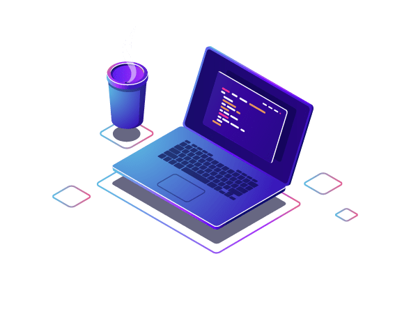

<h1 align="left">Hi , I'm Mustafa Şahin</h1>

  

- ⚡ A passionate software development and promoting digital experiences.

- 👨‍💻 All of my projects are available at [lava run](https://lavarun0.web.app/)

- 💬 Ask me about **JavaScript, HTML, CSS, FİREBASE, FLUTTER, Node.JS**

 

## 🛠 &nbsp;Tech Stack

&nbsp;
&nbsp;
&nbsp;
&nbsp;
&nbsp;
&nbsp;

 

## 🌐 &nbsp;Social Links

  

